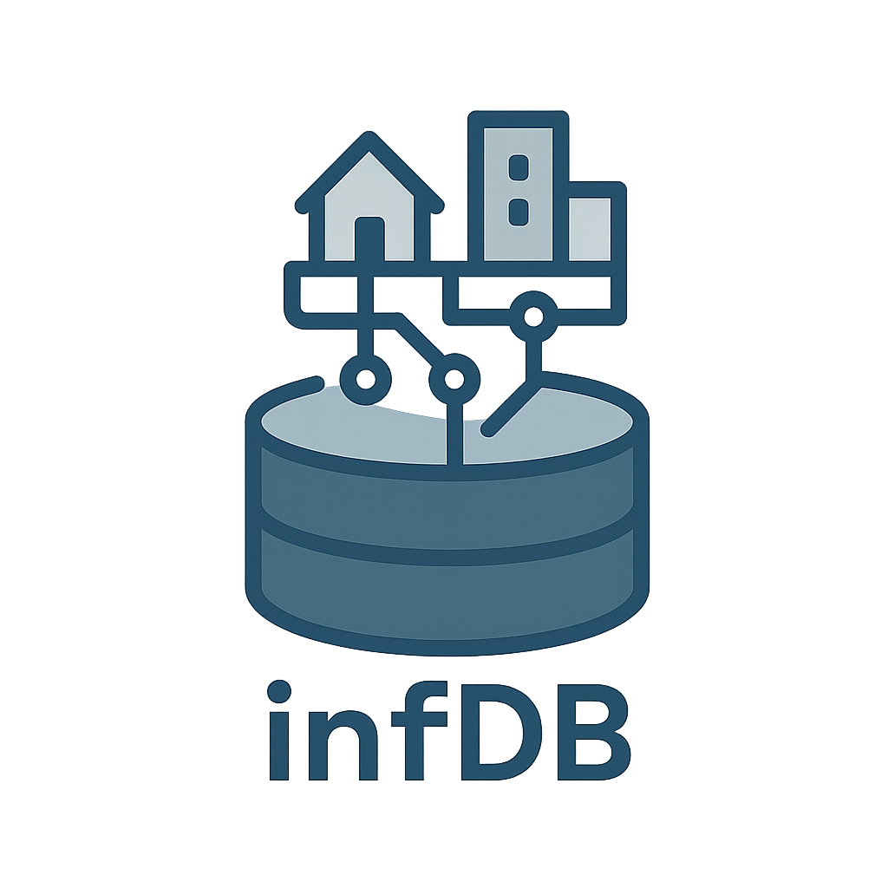
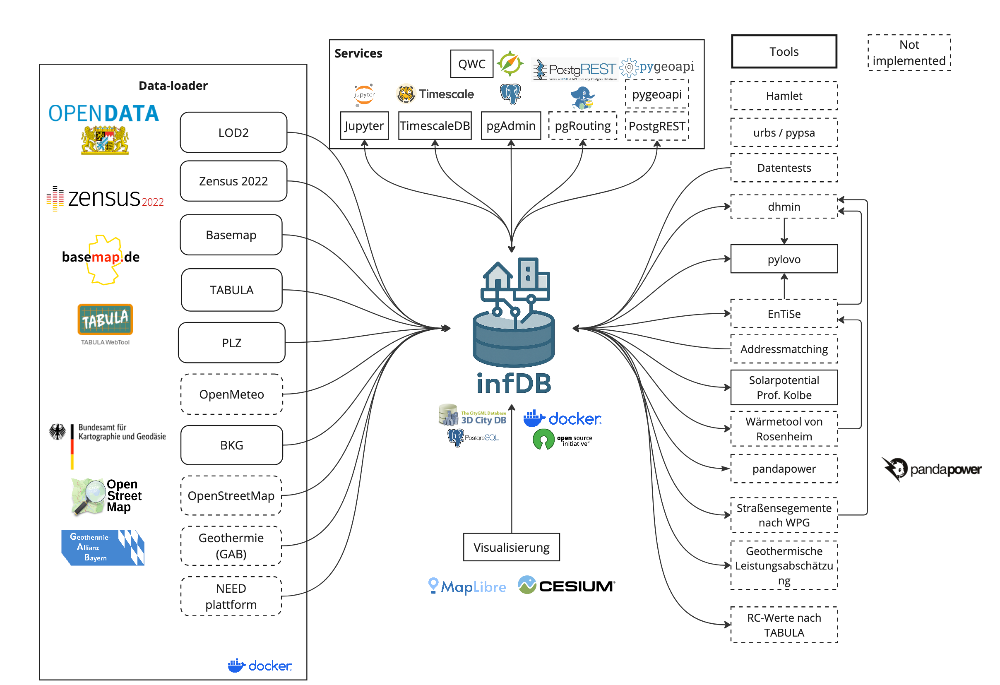

<p align="center">
   
</p>

# infDB - Infrastructure and Energy Database

**The infDB is a user-friendly, platform-independent, and open-source data infrastructure as a foundation for energy system analyses. It enables complex evaluations by combining various tools through standardized interfaces, fostering an open and interoperable ecosystem.**

| Category | Badges |
|----------|--------|
| License | [](LICENSE) |
| Documentation | [](https://gitlab.lrz.de/tum-ens/need/database) |
| Development | [](https://gitlab.lrz.de/tum-ens/need/database/-/issues) [](https://gitlab.lrz.de/tum-ens/need/database/-/issues) [](https://gitlab.lrz.de/tum-ens/need/database/-/merge_requests) [](https://gitlab.lrz.de/tum-ens/need/database/-/merge_requests) |
| Community | [](docs/contributing/CONTRIBUTING.md) [](#) [](#) |

## Table of Contents

- [Purpose](#purpose)
- [How it works?](#how-it-works)
- [Getting Started](#getting-started)
  - [Installation for local development](#installation-for-local-development)
- [For Developers](#for-developers)
   - [Repository Structure](#repository-structure)
   - [Usage Guidelines](#usage-guidelines)
   - [Basic API Usage](#basic-api-usage)
   - [Development Workflow](#development-workflow)
   - [API Documentation](#api-documentation)
   - [CI/CD Workflow](#cicd-workflow)
   - [Development Resources](#development-resources)
   - [Contribution and Code Quality](#contribution-and-code-quality)
- [License and Citation](#license-and-citation)

## Purpose

**infDB (Infrastructure Database)** offers a flexible and easy-to-configure data infrastructure with essential services, minimizing the effort required for data management. By providing standardized interfaces and APIs, infDB streamlines collaboration in energy modeling and analysis, enabling users to focus on insights rather than data handling.

For instance, it can be used for the following applications:
- Energy System Modeling
- Infrastructure Planning
- Scenario Analysis
- Geospatial Analysis

## How it works?
The infDB architecture is composed of three coordinated layers as shown in the figure below:
1. **3D City Database** – foundational geospatial and semantic building data (center)
2. **Services** – preconfigured platform services (top)
3. **Tools** – external connected software and scripts. (right)

The 3D City Database is the basis and extended by services and tools. More information of each layer is described below. 
The 3D City Database and all services are dockerized for a modular and flexible application.


### 3D City Database
The 3D City Database is developed by the Chair of Geoinformatics at Technical University of Munich (TUM) and the basis for infDB. It is a solution for managing, analyzing, and utilizing virtual 3D city models on top of a spatial database system. More information on [http://www.3dcitydb.org/](http://www.3dcitydb.org/)

### Services
Integrated, preconfigured services extending the 3D City Database:

- [TimescaleDB](https://www.timescale.com/): Scalable time-series storage (weather, load, generation) with hypertables, compression, optional continuous aggregates.
- [pgAdmin](https://www.pgadmin.org/): Web UI for inspecting schemas, running SQL, managing roles; auto-configured credentials.
- [FastAPI](https://fastapi.tiangolo.com/): REST endpoints (/city, /weather) with OpenAPI docs and validated access to 3D, geospatial, and time-series data.
- [Jupyter](https://jupyter.org/): Notebook environment (dependencies and env vars preloaded) for exploratory queries, ETL prototypes, reproducible analysis.
- [QWC2](https://github.com/qwc-services/qwc2): Web mapping client for 2D/3D visualization, layer styling, spatial inspection, quick dataset validation.
- [PostgREST](https://postgrest.org/): Auto-generated REST API over PostgreSQL schemas (tables, views, RPC) using DB roles for auth; rapid, lightweight data access without extra backend code.
- [pygeoapi](https://pygeoapi.io/): OGC API (Features/Coverages/Processes) server exposing PostGIS data via standards-based JSON & HTML endpoints for interoperable geospatial discovery and querying.

These services provide core functionalities and support a seamless path from ingestion to analysis and visualization.

### Tools
Tools are external software that is already adopted to the infDB.

Currently integrated tools include:

- infDB-loader: Containerized automated loading public open data for Germany
- infDB-processor: Containerized data transformation and enrichment
- [pylovo](https://github.com/tum-ens/pylovo): Tool for generating synthetic low-voltage distribution grids 

More community or domain-specific tools can be attached through the standardized APIs and database schemas.


## Getting Started
To get started, follow these steps below. For more information in detail read the [https://infdb.readthedocs.io/](https://infdb.readthedocs.io/).

If you are happy with the preconfiguration and default passwords, then just follow these four steps (see detailed instructions in the corresponding sections below):

1. [Clone infDB](#clone-infdb)
2. [Setup infDB](#setup-infdb)
3. [Run infDB](#run-infdb)
4. Optional: [Run infDB-loader](#run-infdb-loader)

### Clone infDB
```bash
    # ssh
     git clone git@gitlab.lrz.de:tum-ens/need/infdb.git

    # https
    git clone https://gitlab.lrz.de/tum-ens/need/infdb.git
```

### Setup infDB
The configuration can be done via [configs/config-infdb.yml](configs/config-infdb.yml)
```yaml
base:
    name: infdb-munich
    path:
        base: "data-infdb/"
    network_name: infdb_network
services:
    citydb:
        user: citydb_user
        password: infdb
        db: citydb
        host: citydb
        exposed_port: 5432
        epsg: 25832 # 3035 (Europe)
        path: 
            base: "{base/path/base}/{base/name}/citydb/"
            compose_file: "dockers/citydb.yml"
        status: active

        ...
```
After doing the configuration you need to generate the configurations files with the following command:
```bash
    # on linux and macos
    docker compose -f services/setup/compose.yml up

    # on windows
```

Once you generated the configuration files with the command above, you need to finally start the infDB:

### Run infDB
```bash
    # on linux and macos
     docker compose -f compose.yml up -d

    # on windows
```
The infDB will be run as long as you stop it manually as described below even when the machine is restarted.

**Hint:** If compose.yml is not found, you either forgot to run the command above or something went wrong. 
Please check the logs of the setup service.


### Stop infDB
```bash
    # on linux and macos
    docker compose -f compose.yml down -v

    # on windows
```

### Setup infDB-loader

The configuration can be done via [configs/config-loader.yml](configs/config-loader.yml)
```yaml
loader:
    name: oberallgaeu
    scope:  # AGS (Amtlicher Gemeindeschlüssel)
        # - 09162000  # Munich
        - 09780139  # Sonthofen
        - 09780116  # Bolsterlang
    multiproccesing: 
        status: active
        max_cores: 10
    config-infdb: "config-infdb.yml" # only filename - change path in ".env" file "CONFIG_INFDB_PATH"
    path:
        base: "data" # only foldername - change path in ".env" file "LOADER_DATA_PATH"
        opendata: "{loader/path/base}/opendata/"
        processed: "{loader/path/base}/{loader/name}"
    logging:
        path: "{loader/path/base}/loader.log"
        level: "DEBUG" # ERROR, WARNING, INFO, DEBUG
    hosts:
        citydb:
            user: None
            password: None
            db: None
            host: None
            exposed_port: None
            epsg: None # 3035 (Europe)
        timescaledb:
            user: None
            password: None
            db: None
            host: None
            exposed_port: None
    sources:
        zensus_2022:
            status: active
            resolutions:
                #- 10km
                #- 1km
                - 100m
            path:
                base: "{loader/path/opendata}/zensus_2022/"
                zip: "{loader/sources/zensus_2022/path/base}/zip/"
                unzip: "{loader/sources/zensus_2022/path/base}/unzip/"
                processed: "{loader/path/processed}/zensus_2022/"
            url: "https://www.zensus2022.de/DE/Ergebnisse-des-Zensus/_inhalt.html"
            schema: opendata
            prefix: cns22
            layer:
                - alter_in_10er-jahresgruppen
                - alter_in_5_altersklassen
                - alter_infr
                - anteil_auslaender

        ...
```

**Hint:** In case you move the infdb-loader source folder outside of the folder tools in repo or want to change the location where the downloaded data is stored, the paths to data and to configs folder need to be defined in [.env](.env)
```bash
    CONFIG_INFDB_PATH=../infdb/configs  # Change if you moved the "configs" folder
    LOADER_DATA_PATH=./     # Change if you moved the "data" folder
```

Once you adjusted the configuration files with the command above, you need to finally start the infDB-loader and start importing:

### Run infDB-loader
```bash
    # on linux and macos
     docker compose -f tools/infdb-loader/compose.yml up

    # on windows
```
The infDB will be run as long as you stop it manually as described below even when the machine is restarted.

**Hint:** If compose.yml is not found, you either forgot to run the command above or something went wrong. 
Please check the logs of the setup service.


### Remove LOD2 data
```bash
    # on linux and macos
    docker run --rm --add-host=host.docker.internal:host-gateway 3dcitydb/citydb-tool delete --delete-mode=delete -H host.docker.internal -d citydb -u citydb_user -p citydb_password -P 5432

    # on windows
```

### PSQL Connection to infDB
```bash
    # on linux and macos
    PGPASSWORD='citydb_password' psql -h localhost -p 5432 -U citydb_user -d citydb

    # on windows
```

### Configurations (only in addition for QGIS Desktop)
.pg_service.conf for QGIS to connect to InfDB via service
```
[infdb]
host=localhost
port=5432
dbname=citydb
user=citydb_user
password=citydb_password
sslmode=disable
```


# For Developers

### Local development environment for InfDB for developers
```bash
    # on linux and macos by installation script
    curl -LsSf https://astral.sh/uv/install.sh | sh
    # or by pip
    pip install uv
```

### Create environment (only once)
```bash
    # linux and macos
    uv sync
```

### Activate environment
```bash
    # linux and macos
    source .venv/bin/activate
    # windows
    venv\Scripts\activate
```
### Clean repo
```bash
    # linux and macos
    git fetch origin
    git reset --hard origin/develop
    git clean -fdx
    # windows
```

## Repository Structure

- **src/**: Main application package
  - **api/**: API endpoints (cityRouter.py, weatherRouter.py)
  - **core/**: Core application code (dbConfig.py, etc.)
  - **db/**: Database models and repositories
    - **models/**: SQLModel classes for database entities
    - **repositories/**: Data access layer for database operations
  - **exceptions/**: Custom exception classes
  - **externals/**: External API integrations (e.g., weather API)
  - **schemas/**: Data schemas and validation
  - **services/**: Business logic services
  - **main.py**: Application entry point
- **docs/**: Documentation
  - **architecture/**: System architecture documentation
  - **contributing/**: Contribution guidelines and code of conduct
  - **development/**: Developer guides and workflows
  - **guidelines/**: Project guidelines and standards
  - **operations/**: Operational guides and CI/CD documentation
  - **source/**: Source files for documentation
  - **img/**: Images used in documentation
- **dockers/**: Docker configuration files
- **tests/**: Test suite
  - **unit/**: Unit tests for individual components
  - **integration/**: Tests for component interactions
  - **e2e/**: End-to-end tests for the application
  - **conftest.py**: Pytest configuration and fixtures


## Development Workflow

1. **Set up the environment** following the installation instructions.
2. **Open an issue** to discuss new features, bugs, or changes.
3. **Create a new branch** for each feature or bug fix based on an issue.
4. **Implement the changes** following the coding guidelines.
5. **Write tests** for new functionality or bug fixes.
6. **Run tests** to ensure the code works as expected.
7. **Create a merge request** to integrate your changes.
8. **Address review comments** and update your code as needed.
9. **Merge the changes** after approval.


## CI/CD Workflow

The CI/CD workflow is set up using GitLab CI/CD. The workflow runs tests, checks code style, and builds the documentation on every push to the repository. You can view workflow results directly in the repository's CI/CD section. For detailed information about the CI/CD workflow, see the [CI/CD Guide](docs/operations/CI_CD_Guide.md).

## Development Resources

The following resources are available to help developers understand and contribute to the project:

### Coding Guidelines

The [Coding Guidelines](docs/guidelines/coding_guidelines.md) document outlines the coding standards and best practices for the project. Start here when trying to understand the project as a developer.

### Architecture Documentation

The [Architecture Documentation](docs/architecture/index.rst) provides an overview of the system architecture, including the database schema, components, and integration points.

### Developer Guides

- [Development Setup Guide](docs/development/setup.md): Comprehensive instructions for setting up a development environment
- [Contribution Workflow](docs/development/workflow.md): Step-by-step process for contributing to the project
- [API Development Guide](docs/development/api_guide.md): Information for developers who want to use or extend the API
- [Database Schema Documentation](docs/development/database_schema.md): Detailed information about the database schema

### Contribution Guidelines

- [Contributing Guide](docs/contributing/CONTRIBUTING.md): Guidelines for contributing to the project
- [Code of Conduct](docs/contributing/CODE_OF_CONDUCT.md): Community standards and expectations
- [Release Procedure](docs/contributing/RELEASE_PROCEDURE.md): Process for creating new releases

### Operations Documentation

- [CI/CD Guide](docs/operations/CI_CD_Guide.md): Detailed information about the CI/CD workflow

## Contribution and Code Quality

Everyone is invited to develop this repository with good intentions. Please follow the workflow described in the [CONTRIBUTING.md](docs/contributing/CONTRIBUTING.md).

### Coding Standards

This repository follows consistent coding styles. Refer to [CONTRIBUTING.md](docs/contributing/CONTRIBUTING.md) and the [Coding Guidelines](docs/guidelines/coding_guidelines.md) for detailed standards.

### Pre-commit Hooks

Pre-commit hooks are configured to check code quality before commits, helping enforce standards.

### Changelog

The changelog is maintained in the [CHANGELOG.md](CHANGELOG.md) file. It lists all changes made to the repository. Follow instructions there to document any updates.

# License and Citation

The code of this repository is licensed under the **MIT License** (MIT).  
See [LICENSE](LICENSE) for rights and obligations.  
See the *Cite this repository* function or [CITATION.cff](CITATION.cff) for citation of this repository.  
Copyright: [TU Munich - ENS](https://www.epe.ed.tum.de/en/ens/homepage/) | [MIT](LICENSE)