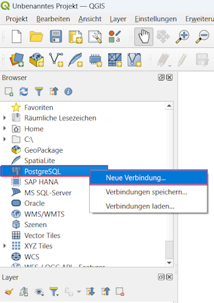

--------------------------------------
QGIS Web Client Documentation for ENS:
--------------------------------------

We use the docker images of the QGIS Web Client (QWC) and qwc-services for visualization of geodata from the 3DCityDB.
Once QWC is set up onthe server, one can create QGIS projects on a local machine with QGIS Desktop and upload them to the server.
The server generates a “theme” from every added project and makes it visible on a web interface.
There is an official GitHub repo for the QWC docker containers, but we use a slightly adjusted version of it with some configuration changes.

| The official documentation for QWC can be found at
| https://qwc-services.github.io/master/
|
| The official GitHub repo can be found at
| https://github.com/qwc-services/qwc-docker
|
| Our adjusted version can be found at
| https://gitlab.lrz.de/tum-ens/need/infdb/-/tree/main/tools/qgis_webclient
|
| After installation, the QWC interface can be reached via
| http://[ip_address]:8088/
|
| And the admin interface can be reached via
| http://[ip_address]:8088/qwc_admin/

-------------
Server Setup:
-------------

If not already installed, you have to install docker (https://docs.docker.com/engine/install/) and docker-compose (https://docs.docker.com/compose/install/) first.

**Get config files from repo:**
::
   git clone https://gitlab.lrz.de/tum-ens/need/infdb.git
   cp -r database/tools/qgis_webclient/ qwc
   rm -r database``

**Change the connection details of the geodatabase (qwc_geodb) in qwc/pg_service.conf:**
::
   [qwc_geodb]
   host=10.162.28.86
   port=1230
   dbname=postgres
   user=postgres
   password=need
   sslmode=disable

**Create a secret key:**
::
   python3 -c 'import secrets; print("JWT_SECRET_KEY=\"%s\"" % secrets.token_hex(48))' >.env

| **Change user and group id in qwc/docker-compose.yml to match the UNIX user that owns the config files:**
| *(you can see which user owns which file with ``ls -l`` and see the uid & gid of every user by ``cat /etc/passwd``)*
| *(if the root user owns the config files, change the file owner of all config files to a regular user with ``chown -R [user] qwc``)*
::
   x-qwc-service-variables: &qwc-service-variables
      [...]
      SERVICE_UID: 1000
      SERVICE_GID: 1000

**Initialize & start docker containers:** ``docker compose up -d``

**Generate service configuration:** see section "Publish/Update Project" (initial username & password: admin)

| Start/stop QWC with ``docker compose up –d`` and ``docker compose down``
| *(do not use „docker compose restart“, it may result in server errors)*

---------------------
Local Configurations:
---------------------

*(shown for Windows)*

| **Add service configuration file pg_service.conf:**
| *(e.g. under "C:\\Users\\JohnDoe\\pg_service.conf")*
| *(save the file in UNIX format regarding EOL delimiter / use sample file)*
| *(see* https://docs.qgis.org/3.40/en/docs/user_manual/managing_data_source/opening_data.html#postgresql-service-connection-file\ *)*
|
::

   [qwc_geodb]
   host=10.162.28.86
   port=1230
   dbname=postgres
   user=postgres
   password=need
   sslmode=disable

**Add path to service configuration file to environment variable PGSERVICEFILE:**

|
| **Connect to the database via service configuration:**
| *(use LTS QGIS version 3.40.8 to be compatible with the QGIS server image; see* https://download.qgis.org/downloads/\ *)*
|

|image1|\ |image2|

-----------------------
Publish/Update Project:
-----------------------

| **Create QGIS project and save it**
| *(Note: QWC uses .qgs files by default. We changed this setting to .qgz files because that is the default saving format of QGIS Desktop.)*
|
**Upload the project:**
::

   scp .\\project.qgz [username]@[ip_address]:~/qwc/volumes/qgs-resources/scan/project.qgz

| **Open admin webinterface and log in:**
| *(address: http://[ip_address]:8088/qwc_admin/)*
|

|
**Generate service configuration:**

------------------------------------
Tips for Working with QGIS Projects:
------------------------------------

We recommend some methods to make the maintenance of QGIS projects
easier. For pylovo, there already exist two template project files in
the pylovo repo (https://github.com/tum-ens/pylovo/tree/main/QGIS). One
is for local use and its layers use hard-coded data sources, the other
is for use with QWC and its layers refer to a service definition as
described above. Apart from that the two files are identical. The
general maintenance techniques are described now:

1. **Dynamic styling with project variables**

When the styles of multiple layers use the same values (e.g. for
thickness of lines), it can make sense to define the value in a
project variable (*Project > Properties > Variables*) and then
reference the variable in the respective layers instead of hardcoding
the value in every layer. That makes it easier to change such style
values.

More on project variables can be found under
https://docs.qgis.org/3.40/en/docs/user_manual/introduction/general_tools.html#general-tools-variables

2. **Dynamic version filtering with project variables and styles**

In pylovo, the database can contain data that was created with
different parameter sets, where each parameter set is identified by a
version_id. In the visualization, usually only one version of the
data shall be shown. To do so, one can again define a project
variable that contains the version_id of the data version that shall
currently be shown. The layers, whose source tables contain different
versions, are then assigned with conditional styling rules to only show the data for which the table value of the respective column mataches the value of the project variable, where the table value is in quotes and the project variable denoted with @.
(*some layer > Properties > Symbology > Symbol > Enable symbol layer > Data defined override (expression) > "version_id" = @version_id*)

3. **Dynamic data sources with service definitions**

By using a service definition file that contains a datasource (host,
port, database, user, password…) and referencing only the defined
service name instead of all connection details, changing data sources
becomes a lot easier, because only the service definition file has to
be changed. It is also useful because QWC also uses this service
definition approach and when you add the same service definition file
to your local machine as on the QWC server, you can upload and add
projects to QWC without changing data sources.

The service config file is described below under *Changed Files > 1. pg_service.conf* and the setup of the file and the layer data sources
on Windows are described above under *Local Configurations*.

.. |image2| image:: ../img/add_service_name.png

--------------
Changed Files:
--------------

In the following, all files that were changed or added in comparison to the original QWC services repo are described.
The path is always given relative to the /qwc/ directory.

1. **pg_service.conf:**

This file contains two service definitions. A service definition
contains all connection details needed to connect to a specific database
(host, port, database name, username, password, if SSL is to be used)
and summarizes them under a single name (the service name). In QGIS
layer definitions, a database can be addressed by a service name,
erasing the need to add all connection details to every single layer.
The service name can also be seen as proxy for the connection details,
as it allows to change the connection details by editing the
``pg_service.conf`` without having to edit the layers. The concept of
service files is also described here:
https://docs.qgis.org/3.40/en/docs/user_manual/managing_data_source/opening_data.html#postgresql-service-connection-file

The file contains one service definition for the config database
(``qwc_configdb``) that contains internal values of QWC. This definition is
unchanged from the repo. The other service definition is for the geodatabase that contains
spatial data (``qwc_geodb``). This definition was adjusted in comparison to
the repo. When connection details of the geodatabase change (e.g. by
moving to another server), this definition must be updated.

2. **volumes/config-in/default/themesConfig.json**

This file contains config parameters that define how QWC generates
themes from the uploaded QGIS project files. A theme is a visualization
of a QGIS project on the QWC server and it is generated from the project
file itself in combination with the config parameters defined here.
Config parameters can be settings for specific themes (project files) or
default values for all themes (project files). They include for example
the background layer of a theme.

The file was largely reworked in comparison to that from the original repo.
A complete manual to configure themes including a table with all possible config parameters can be found at
`https://qwc-services.github.io/master/configuration/ThemesConfiguration/#configuring-the-themes-in-themesconfigjson <https://qwc-services.github.io/master/configuration/ThemesConfiguration/%23configuring-the-themes-in-themesconfigjson>`__.

3. **volumes/config-in/default/tenantConfig.json**

This file is similar to the themesConfig.json, but it contains more general settings for the config generation.
The only config parameter added is ``"qgis_project_extension": ".qgz"``, so that QWC accepts ``.qgz``-projects instead of ``.qgs``-projects.
There are two types of QGIS-projects, ``.qgs``, which are basically normal XML files and ``.qgz``, which are zipped ``.qgs`` files.
As QGIS Desktop by default saves projects as ``.qgz``, we also rely on that for production purposes, but it may be useful to save a project as ``.qgs`` to see the XML tags in plain text.

4. **docker-compose.yml**

This file is an adjusted copy of ``docker-compose-example.yml``.
We changed the following lines:

We uncommented these lines. They should be set to the UID & GID of the UNIX user that owns the /qwc/ directory.
You can see which user owns which file with ``ls -l`` and see the uid & gid of every user by ``cat /etc/passwd``.
If the root user owns the config files, change the file owner of all config files to a regular user with ``chown -R [user] qwc``.
::

   SERVICE_UID: 1000
   SERVICE_GID: 1000

We commented these lines out to remove the demo theme:
::

   #- ./volumes/demo-data/setup-demo-data.sh:/docker-entrypoint-initdb.d/2_setup-demo-data.sh
   [...]
   #- ./volumes/demo-data/setup-demo-data-permissions.sh:/tmp/extra-init.d/setup-demo-data-permissions.sh

We added this line to set the QGIS project file extension (see above: 3. volumes/config-in/default/tenantConfig.json):
::

   QGIS_PROJECT_SUFFIX: 'qgz'

We added this line to enable multithread rendering of the map viewer for increased performance:
::

   QGIS_SERVER_PARALLEL_RENDERING: 1

5. **api-gateway/nginx.conf**

This file is an exact copy of ``api-gateway/nginx-example.conf``.

6. **volumes/qgs-resources/scan/pylovo.qgz**

This is a prepared QGIS project file for visualization of data belonging to the pylovo tool.
More project files can be created in QGIS Desktop and then added to the ``/scan/`` folder for other projects/purposes.
The files are automatically scanned and respective themes within QWC are generated when the the service configuration is generated over the admin interface (see section "Publish/Update Project").

7. **volumes/qwc2/assets/img/mapthumbs/pylovo.png**

This is the thumbnail picture for the pylovo theme.
For other themes, thumbnails can also be added to the ``/mapthumbs/`` folder.
The file name of the thumbnail picture must always equal the name of the project file from which the theme is generated.

