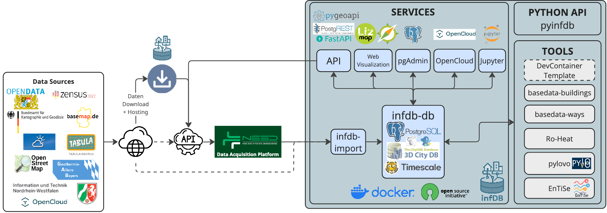

# Services
The InfDB platform provides a suite of essential services designed to facilitate database operation and administration, data handling and visualization, and connectivity. Each preconfigured service can be activated individually to tailor the environment to your specific requirements.

The usage of the services of InfDB is explained in the [Usage -> Services](../../usage/services) section.