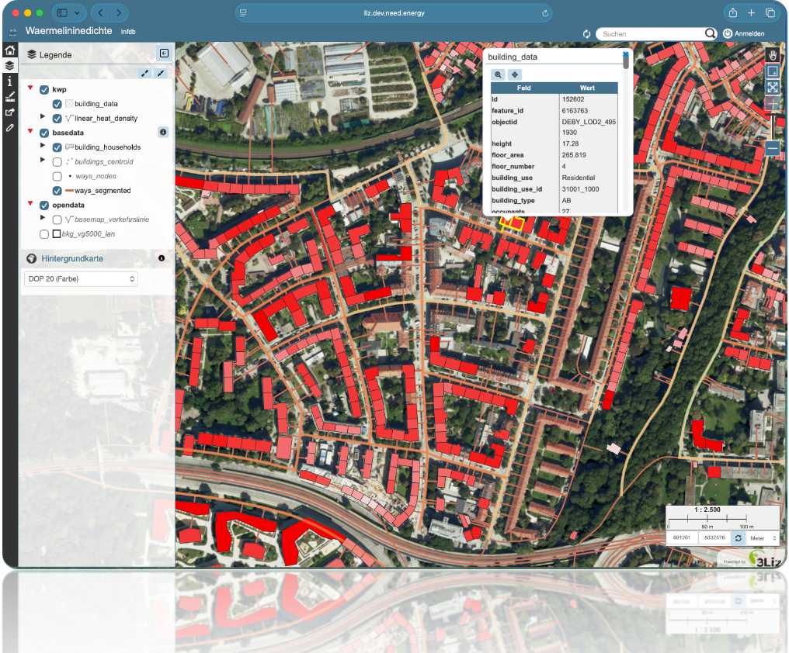
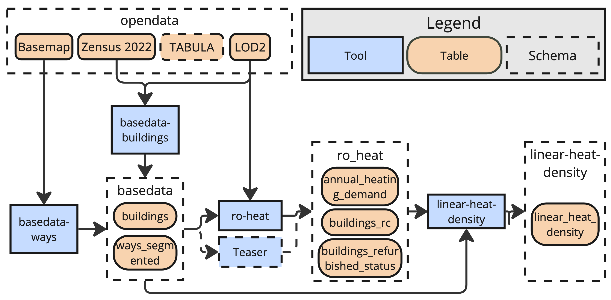

# Linear Heat Density Use Case

Within the linear heat density demo, we illustrate how to leverage the InfDB platform to estimate the linear heat density of streets as a key metric for assessing the feasibility and efficiency of district heating networks.
This use case demonstrates the integration of various data sources and analytical tools within the InfDB ecosystem to derive meaningful metrics for urban energy infrastructure planning.




## Run Linear Heat Density
To run the complete linear heat density toolchain, use the following command:
```bash
uv run python3 tools/tools.py -p linear
```
The InfDB connects several tools to determine linear heat density by estimating heat demand at the building level and processing street segments suitable for district heating.

## Toolchain


The linear heat density toolchain is implemented through a combination of open-source tools and custom scripts, executed within the InfDB environment:

1. The building heat demand is estimated on a building level using statistical data and building characteristics. 
2. Suitable streets for district heating are identified based on various criteria such as building density, street length, and connectivity. 
3. The linear heat density is calculated by aggregating the heat demand of buildings along each street segment and dividing it by the length of the street.




