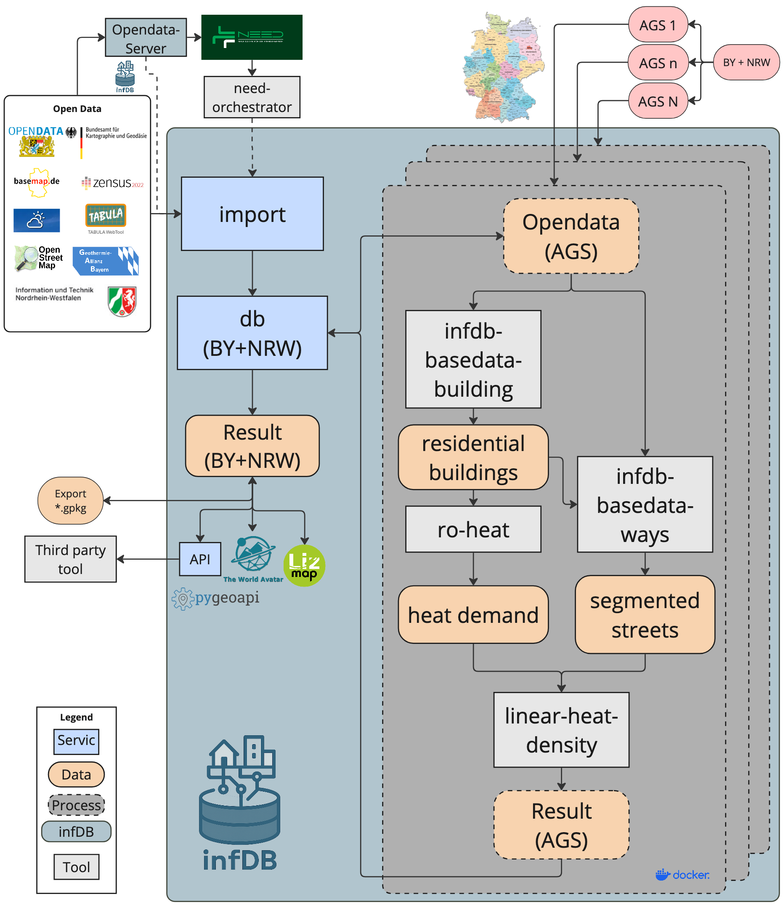

# Toolchain

The linear heat density toolchain is implemented through a combination of open-source tools and custom scripts, executed within the InfDB environment:

1. The building heat demand is estimated on a building level using statistical data and building characteristics. 
2. Suitable streets for district heating are identified based on various criteria such as building density, street length, and connectivity. 
3. The linear heat density is calculated by aggregating the heat demand of buildings along each street segment and dividing it by the length of the street.

The corresponding data model for the linear heat density toolchain is shown in the figure below. It illustrates the flow of data between the different tools and how they interact with the InfDB database to store and retrieve information throughout the process.

