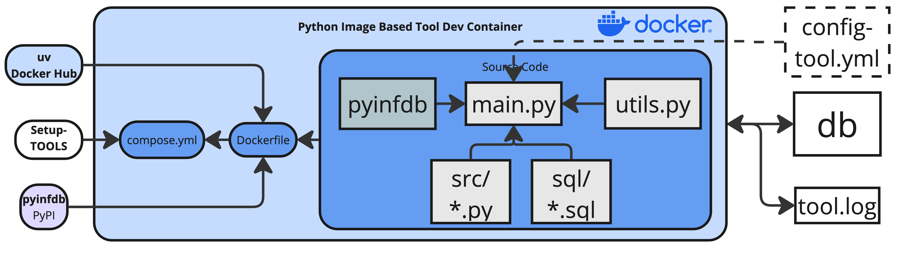

# InfDB Tool Template

A reusable template for creating Docker-based development containers that interact with the InfDB infrastructure. This template provides a standardized structure for importing (eg. infdb-laoder) data,  processing tools (eg infdb-basedata), and analysis scripts (kwp) that work with the InfDB PostgreSQL/PostGIS database.



This template enables you to:

- Quickly scaffold new InfDB tools with consistent structure
- Access InfDB database connections with pre-configured clients
- Run Python scripts with geospatial capabilities (GeoPandas, SQLAlchemy)
- Execute SQL scripts for database operations
- Develop with VS Code dev containers for debugging

## Getting Started
Prerequisites:

- [Docker Desktop](https://docs.docker.com/get-started/get-docker/) (or Docker Engine) installed
- Follow [development workflow instructions](#development-workflow) below
- Run commands from the repository root

**Option A — Docker Compose:**
Start tool
```bash
docker bash tools/choose-a-name/run.sh
```

**Option B — VS Code Dev Containers:**

1. Open created tool folder in [*Visual Studio Code*](https://code.visualstudio.com/download): File → → Open Folder... → `tools/choose-a-name`
2. Install the “Dev Containers” extension
3. Press F1 → “Dev Containers: Reopen in Container”
4. Run and debug (F5) with breakpoints in Python

**Hint**: If there is an error on startup while building since dev container already exists by using **Option A**, then delete it before manually:
```bash
# Remove docker
docker compose -f tools/choose-a-name/compose.yml down
```
