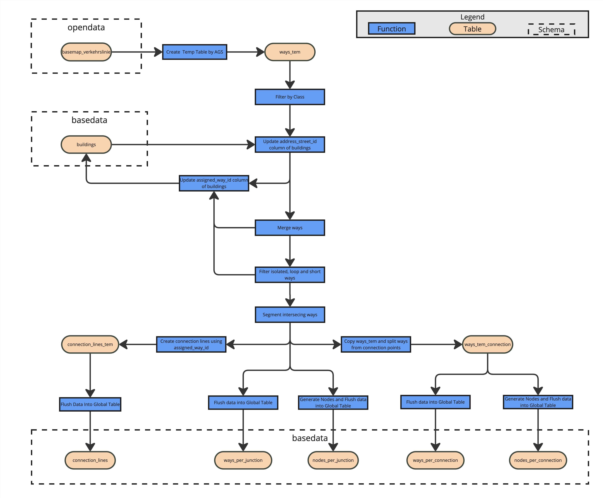

# Data Pipeline

The data pipeline of the `infDB-basedata-ways` is shown in the following figure. It consists of three main stages: data transformation, validation and enrichment. The pipeline is designed to process ways-related data from various sources and prepare it for use in infDB.
