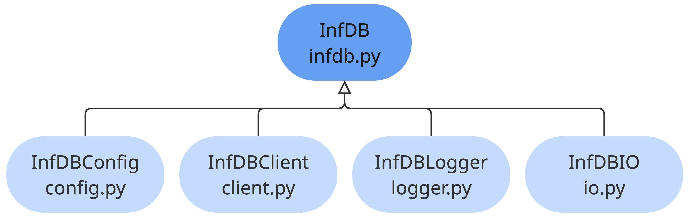

# InfDB-basedata-ways
The tool `infDB-basedata-ways` processes ways-related data as fundamental data basis for various applications and analyses.

<!-- ## Contents
- Objective (Scope, Motivation)
- Architecture (Design, Implementation)
    - Structure (Project/Code)
    - Data Pipeline
    - Code (Classes and Functions)
    - Dependencies
- Usage (Quick Start, Requirements, Configuration) -->

## Structure
The `pyinfdb` package consists of a superior class InfDB based on the internal classes InDBConfig, InfDBClient, InfDBLogger and InfDBIO as shown in the following figure:

The user only interacts with the superior InfDB class, the internal classes are not directly accessible. This abstraction ensures the python interface is consistent despite changes in the internal structure of the package.
It provides functions for database access, configuration management, logging and data handling. The central idea is to provide standard methods to interact with InfDB in order to simplify the interaction with InfDB.

## Usage
Details on how to use the tool can be found in the [Usage](usage.md) section.

## Architecture
The architecture of the `infDB-basedata-ways` tool is based on the InfDB Dev Container template as described in the [Tools Template](../dev-container/index.md) section. The tool is implemented in Python and utilizes the `pyinfdb` package for interaction with infDB. The database operations are executed using SQL queries. More details can be found in the [Architecture](architecture.md) section.

## Data Pipeline
More details can be found in the [Data Pipeline](data-pipeline.md) section.

## Tool Overview
- Loads way segments from the Basemap Verkehrslinie dataset for the selected AGS
- Filters the input way network to keep only the classes defined in the configuration
- Assigns buildings to way segments using building address information where available; if no address-based assignment is possible, buildings are assigned to the nearest way segment
- Merges consecutive way segments that belong to the same straight way section and are not separated by a junction, reducing unnecessary segmentation in the network
- Filters way segments based on the configured rules for loops, short segments, and isolated segments
- Splits way segments at intersections so that the way network has a consistent segmented topology
- Creates connection lines between buildings and their assigned way segments
- Creates network nodes from junction points
- Outputs the processed way network for downstream tools

