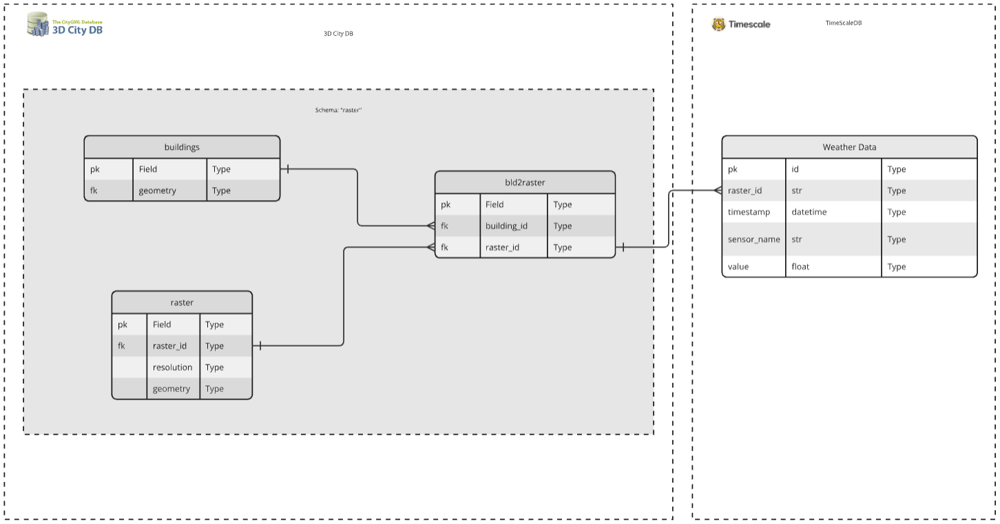

Architecture
============

This chapter describes the architecture of the InfDB project, which integrates geospatial and temporal data.

System Overview
---------------

InfDB is a data integration project that combines static 3D city models with dynamic time-series data. It bridges 3DCityDB and TimescaleDB by leveraging raster-based spatial resolution.

Depending on the given resolution (e.g., 100m, 1000m), InfDB generates same grids under raster table with the same time of IDs provided by https://gdz.bkg.bund.de/index.php/default/open-data/geographische-gitter-fur-deutschland-in-lambert-projektion-geogitter-inspire.html

Each building is assigned to one or more rasters based on a given resolution (e.g., 100m, 1000m). Each raster has a unique ID, allowing weather data to be associated with spatial regions. By resolving a building's assigned raster(s), the system can efficiently fetch related historical weather data.

For Api usage, you can check API Overview.

Components
----------

- **3DCityDB**  
  A spatial database (PostgreSQL/PostGIS) storing static city model data such as buildings, terrain, and geometry.

- **TimescaleDB**  
  A time-series extension of PostgreSQL used to store and query dynamic data like historical weather measurements.

- **FastAPI Backend**  
  A Python-based web service exposing RESTful endpoints for interacting with both databases.

- **Data Importer**  
  A modular system designed to import sepearate data source at any time to 3DCityDB. Each importer is automated using Docker Compose and integrates with 3DCityDB via the CityDBImporter tool.

.. image:: ../../img/data_import_architecture.png
   :alt: InfDB Architecture
   :align: center

Database Schema
---------------

- **3DCityDB Schema**  

  Based on the CityGML model, it includes two additional application tables created at startup:

  
  - **`raster`**  
  
    - Contains a unique `raster_id`, a `resolution` (100, 1000, 10000, 100000 in meters), and associated geometry.  
    - IDs are generated in the same format as described at: https://gdz.bkg.bund.de/index.php/default/open-data/geographische-gitter-fur-deutschland-in-lambert-projektion-geogitter-inspire.html

    
  - **`building_2_raster`**  
    A many-to-many mapping table between buildings and rasters:

    
    - Links each `building_id` to a `raster_id` with an associated resolution.  
    - Supports multiple assignments of the same building to different rasters based on resolution.  
    - Allows each raster to contain multiple buildings.  
    - Enforces uniqueness through a composite key on (`building_id`, `raster_id`).  

- **TimescaleDB Schema**  
  Stores time-stamped sensor readings (e.g., temperature) linked to a `raster_id`.

Integration Points
------------------

- **CityDB Tool**  
  Loads validated GML files into 3DCityDB.

- **External Weather APIs**  
  Connects to the Weather Service for historical weather data fetching.

- **Visualization Tools**  
  Static CityDB data can be visualized via QGIS.

    .. image:: ../../img/qgis_example.png
        :width: 500px
        :alt: Qgis example

