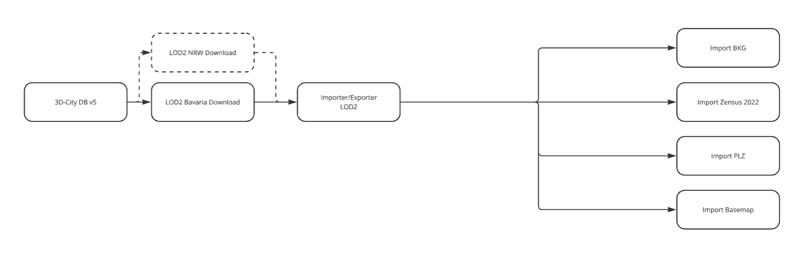

Core Operational Services
=========================

In addition to the core architectural components like 3DCityDB and TimescaleDB, InfDB includes two major services that enable automated data ingestion and domain-specific analysis workflows. These services encapsulate complex orchestration logic and support modular, extensible operations through containerized pipelines.

Data Loader
-----------

The Data Loader is a Docker-based orchestration system that automates infrastructure setup. It manages the deployment of essential services like CityDB, TimescaleDB, and pgAdmin, ensures proper health checks, and dynamically generates configuration files:

- ``.env`` — defines environment variables
- ``docker-compose.yml`` — generated from ``configs/config-service.yml``

Each service has its own Docker Compose YAML definition in the ``dockers/`` folder. Service dependencies and health checks are declared there. For example, ``pgadmin.yml`` includes:

Supported datasets:

- Buildings (LOD2): `Bavarian Geodata <https://geodaten.bayern.de>`_
- Streets: `BaseMap Open Data <https://basemap.de/open-data/>`_
- Administrative boundaries: `BKG (Federal Agency for Cartography and Geodesy) <https://gdz.bkg.bund.de>`_
- Postal codes: `Postal Code Search <https://www.suche-postleitzahl.org>`_

Data is stored under folders named by the service in ``base_dir/$name/*``:

+----------+--------------------------------------+
| Folder   | Description                          |
+==========+======================================+
| opendata | Storage for all downloaded open data |
| venv     | Virtual Python environment           |
+----------+--------------------------------------+

Configurations are stored in:

- ``configs/config-service.yml`` — for service definitions and ports
- ``configs/config-loader.yml`` — for open data loading

.. code-block:: yaml

   services:
     pgadmin:
       image: dpage/pgadmin4
       depends_on:
         citydb:
           condition: service_healthy
         timescaledb:
           condition: service_healthy

Environment variables are generated automatically by ``generate-compose.py``. All services share a common Docker network to allow inter-service communication.

Detailed usage and examples are documented in the respective ``README.md`` files inside each service folder. You can also find them under  :doc:`../development/local_setup`

Solar Potential Calculations
----------------------------

This service estimates irradiance values on 3D buildings using solar simulation tools.

Setup follows the workflow described in the official `SunPot guide <https://advanced-gis-for-ee.netlify.app/software-lab-2/solar-potential-analysis>`_.

Required container images can be pulled manually:

.. code-block:: bash

   docker login gitlab.lrz.de:5005 --username <user> --password <token>
   docker pull gitlab.lrz.de:5005/sunpot/sunpot-core

Core Computation Example:

.. code-block:: bash

   docker run --rm --net=host --name sunpot-core \
     -v sunpotConfig.xml:/config/sunpotConfig.xml \
     gitlab.lrz.de:5005/sunpot/sunpot-core \
     -r -h localhost -p 1235 -d citydb -u postgres -pw need /config/sunpotConfig.xml

Texture Generation:

.. code-block:: bash

   docker run --net=host --name sunpot-tex \
     gitlab.lrz.de:5005/sunpot/sunpot-texture \
     -h localhost -p 1235 -d citydb -u postgres -pw need -y

Detailed usage and examples are documented in the respective ``README.md`` files inside each service folder. You can also find them under  :doc:`../development/solar_pipeline`
