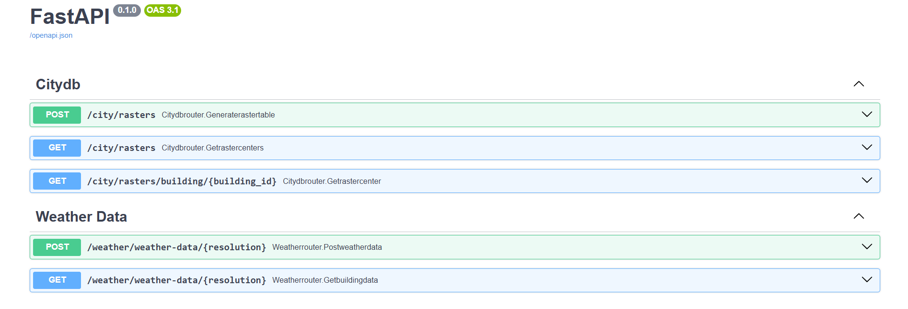

Getting Started
===============

To get started, follow these steps:

Requirements
------------

- Python (for scripting and API backend)
- Git for version control (`https://git-scm.com/`)
- Docker and Docker Compose
- QGIS (optional, might be needed for visualization, but not required for InfDB)
- PgAdmin (the `docker-compose.local.yaml` includes a web client for PgAdmin)

Installation for Local Development
----------------------------------

#. Clone the repository to your local machine:

   .. code-block:: bash

      git clone <repository_url>

#. Set up a virtual environment:

   .. code-block:: bash

      python -m venv venv

      # For Windows
      source venv\Scripts\activate

      # For Linux/MacOS
      source venv/bin/activate

#. Install dependencies:

   .. code-block:: bash

      pip install -r requirements.txt

#. InfDB depends on 3DCityDB and TimescaleDB. Use the following command to start both services locally using Docker. Please only run the services you would need!:

   .. code-block:: bash

      docker-compose -f docker-compose.local.yaml up -d

#. To use 3DCityDB, you need to import demo data. Use the following commands with the provided Docker Compose file:
   (Note: If you haven’t deleted the volume previously created for 3DCityDB, you don’t need to run this again.)

   .. code-block:: bash

      # This will download LOD2 data and import it into 3DCityDB
      docker-compose -f docker-compose.lod2-import.yaml run --rm downloader
      docker-compose -f docker-compose.lod2-import.yaml run --rm citydb-tool

#. Use already existing `.env` file in the repository. If you have given different environment variables during database initializations, please also update the env file. Use the same values defined in `docker-compose.local.yaml`:

   .. code-block:: bash

      # TimescaleDB Configuration
      TIMESCALE_USER=
      TIMESCALE_PASSWORD=
      TIMESCALE_HOST=127.0.0.1
      TIMESCALE_PORT=
      TIMESCALE_DB=

      # CityDB Configuration
      CITYDB_USER=
      CITYDB_PASSWORD=
      CITYDB_HOST=127.0.0.1
      CITYDB_PORT=
      CITYDB_DB=

      # General Configuration
      DEBUG=true

#. Start the FastAPI application:

   .. code-block:: bash

      fastapi dev src/main.py

#. Open your browser and navigate to the API documentation at: `http://127.0.0.1:8000/docs`

If you want to import different sources of data other than LOD2 via `data_import`
---------------------------------------------------------------------------------

#. LOD2 data is must have for application, So if not already done in the previous steps, please import the LOD2 data. Otherwise, you can skip this.

   .. code-block:: bash

      docker-compose -f docker-compose.lod2-import.yaml run --rm downloader
      docker-compose -f docker-compose.lod2-import.yaml run --rm citydb-tool

#. After importing LOD2 data, we should create a shared image for data_import services for the next step. You can also just use docker build command and give a proper name according to your needs, but then you have to use the correct image name in the docker-compose.data_import.yaml for each service!. This could be easier to track which image name we had.
   
   .. code-block:: bash
      docker-compose -f docker-compose.data_import.yaml run --rm _myimage_build

#. Now you can use the `data_import` to upload different types of data, depending on the available services. Please check for `.env` file in the main directory and `open-data-config` file under `data_import`. It provides env variables for the `data_import` but those values might be different depending on how you initialized your databases:

   .. code-block:: bash

      # Example services defined in data_import.yaml include:
      # imp_lod2
      # imp_bkg
      # imp_basemap
      # imp_census2022
      # imp_plz
      docker-compose -f docker-compose.data_import.yaml run --rm <service_name>

.. image:: ../../img/data_import_architecture.png
   :alt: InfDB Data Import Architecture
   :align: center

Sunsetting CityDB V4 and migrating solarpotantial to V5 via `data_import`
---------------------------------------------------------------------------------

#. You should have cityDB v4 running on your system.

#. You should pull the image from gitlab repository, please check the `readme` file under `data_import\sunpot`

#. You should run the solar potential calculation services under `docker-compose.sunset.yaml`.

   .. code-block:: bash

      docker-compose -f docker-compose.sunset.yaml run --rm sunpot-core
      docker-compose -f docker-compose.sunset.yaml run --rm sunpot-texture

#. You should run next 2 services under `docker-compose.sunset.yaml` 1 by 1. It will export `gml` data under `data_import/sunpot/data`. And then via `import-sunset-to-v5` service you can import your data to citydb v5 database. Please check for the sercie configurations if you want to see where the data is written and how it's configured.

   .. code-block:: bash

      docker-compose -f docker-compose.sunset.yaml run --rm export
      docker-compose -f docker-compose.sunset.yaml run --rm import-sunset-to-v5

Running the Application with Docker Compose (FastAPI + Databases)
---------------------------------------------------------------------

#. Clone the repository:

   .. code-block:: bash

      git clone <repository_url>

#. Build the FastAPI Docker image:

   .. code-block:: bash

      docker-compose build

#. Start all services (FastAPI, TimescaleDB, 3DCityDB) in containers:

   .. code-block:: bash

      docker-compose up -d

#. Import LOD2 data into 3DCityDB using the following commands:
   (Note: Skip this step if the volume has already been created and populated.)

   .. code-block:: bash

      docker-compose -f docker-compose.lod2-import.yaml run --rm downloader
      docker-compose -f docker-compose.lod2-import.yaml run --rm citydb-tool

#. If you want to import different types of data (not just LOD2), you can follow similar steps using the `data_import` configuration described in the section above.
