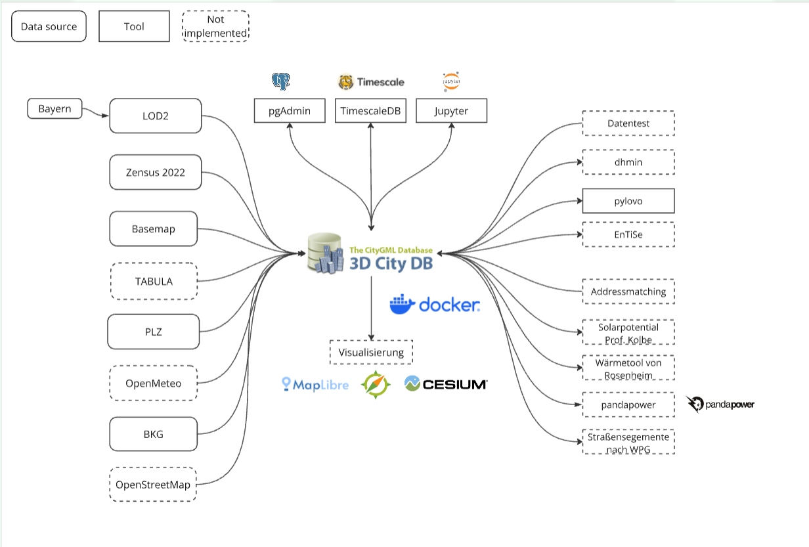

Introduction
==============

Overview
--------

InfDB (Infrastructure Database) is a software platform that combines 3D city models with time-based data like weather or electricity usage. It connects location-based data (such as buildings and streets) with time-related data (such as daily temperatures or energy demand).

InfDB is built on two main technologies:

* **3DCityDB** – to store and manage detailed 3D models of cities.
* **TimescaleDB** – to store time-series data like weather or energy measurements.

This platform helps planners and researchers understand how buildings and infrastructure are affected by changing data over time. It supports better decisions in energy planning and city management.

Purpose
-------

The goal of InfDB is to seamlessly combine the static, spatial data managed by 3DCityDB with the dynamic, temporal data stored in TimescaleDB.

Features
--------

* Integration with 3DCityDB for managing 3D city models.
* Data import support via CityDB-Tool for multiple data sources.
* Use of TimescaleDB for storing time-series data like weather or electricity consumption.
* Internal raster generation to link spatial and temporal data (3DCityDB ↔ TimescaleDB).
* Weather and sensor data importer for populating TimescaleDB, including querying through raster-based building-to-data mapping.
* Modular architecture allowing future extensions for new infrastructure types or simulation tools.
