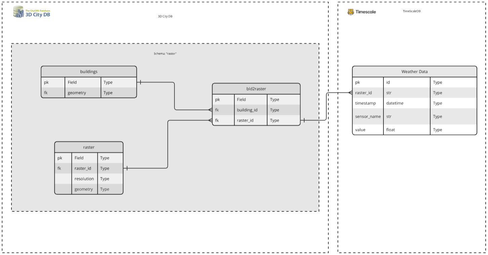

User Guide
==========

This chapter outlines the architecture of **InfDB**.

System Overview
----------------

InfDB combines static **3D city models** with dynamic **time-series** information. It acts as a bridge between **3DCityDB** and **TimescaleDB** by introducing a raster-based resolutions.

.. note::

   For every required resolution (``100 m``, ``1 000 m``, ``10 000 m``, ``100 000 m``), InfDB creates a matching grid in the ``raster`` table.  
   The grid-cell IDs follow the official scheme published by the `Federal Agency for Cartography and Geodesy (BKG) <https://gdz.bkg.bund.de/index.php/default/open-data/geographische-gitter-fur-deutschland-in-lambert-projektion-geogitter-inspire.html>`_.

Each building is connected to one or more raster cells. Weather data is stored using these raster IDs, so the system can quickly find all past weather information related to a building.

Components
----------

+---------------------+-----------------------------------------------------------------------------------------------------+
| **Component**       | **Role**                                                                                            |
+=====================+=====================================================================================================+
| **3DCityDB**        | PostgreSQL/PostGIS database storing the static CityGML city model                                   |
|                     | (buildings, terrain, geometry).                                                                     |
+---------------------+-----------------------------------------------------------------------------------------------------+
| **TimescaleDB**     | PostgreSQL extension optimised for high-volume time-series data                                     |
|                     | (e.g., weather measurements).                                                                       |
+---------------------+-----------------------------------------------------------------------------------------------------+
| **FastAPI backend** | Python web service that exposes REST endpoints for read/write access to both databases.             |
+---------------------+-----------------------------------------------------------------------------------------------------+

Database Schema
---------------

3DCityDB
^^^^^^^^^

+------------------------+-----------------------------------------------------------------------------------------+
| **Table**              | **Purpose**                                                                             |
+========================+=========================================================================================+
| **raster**             | Stores raster grid cells. Includes raster_id (PK), resolution, and geom.                |
|                        | The raster_id follows the BKG grid ID convention.                                       |
+------------------------+-----------------------------------------------------------------------------------------+
| **building_2_raster**  | Maps each building_id to one or more raster_id entries. Composite PK on                 |
|                        | (building_id, raster_id). Allows many-to-many relationships.                            |
+------------------------+-----------------------------------------------------------------------------------------+

TimescaleDB
^^^^^^^^^^^

+------------------+--------------------------------------------------------------------------------------------+
| **Table**        | **Purpose**                                                                                |
+==================+============================================================================================+
| **weather_data** | Stores time-stamped sensor readings such as temperature, humidity, and more.               |
|                  | Each record includes raster_id, timestamp, sensor_name, and value.                         |
|                  | Enables querying historical weather data for spatial regions.                              |
+------------------+--------------------------------------------------------------------------------------------+

Example Data Relations
----------------------

Here are example entries showing how the tables are related:

**raster** table:

+------------+-----------+----------------------------------+
| raster_id  | resolution| geom (WKB format, simplified)    |
+============+===========+==================================+
| DE_100_123 | 100       | POLYGON((11.5 48.1, ...))        |
+------------+-----------+----------------------------------+
| DE_100_124 | 100       | POLYGON((11.6 48.1, ...))        |
+------------+-----------+----------------------------------+
| DE_1000_45 | 1000      | POLYGON((11.5 48.0, ...))        |
+------------+-----------+----------------------------------+

**building_2_raster** table:

+-------------+------------+
| building_id | raster_id  |
+=============+============+
| BLDG_001    | DE_100_123 |
+-------------+------------+
| BLDG_001    | DE_100_124 |
+-------------+------------+
| BLDG_002    | DE_100_123 |
+-------------+------------+

**weather_data** table:

+------------+---------------------+-------------+-------+
| raster_id  | timestamp           | sensor_name | value |
+============+=====================+=============+=======+
| DE_100_123 | 2024-01-01 12:00:00 | temperature | 20.5  |
+------------+---------------------+-------------+-------+
| DE_100_123 | 2024-01-01 12:00:00 | humidity    | 65.0  |
+------------+---------------------+-------------+-------+
| DE_100_124 | 2024-01-01 12:00:00 | temperature | 20.3  |
+------------+---------------------+-------------+-------+

This example shows:

- Building BLDG_001 spans two 100m raster cells (DE_100_123 and DE_100_124)
- Building BLDG_002 is contained within one cell (DE_100_123)
- Weather measurements are stored per raster cell with timestamp and sensor type
