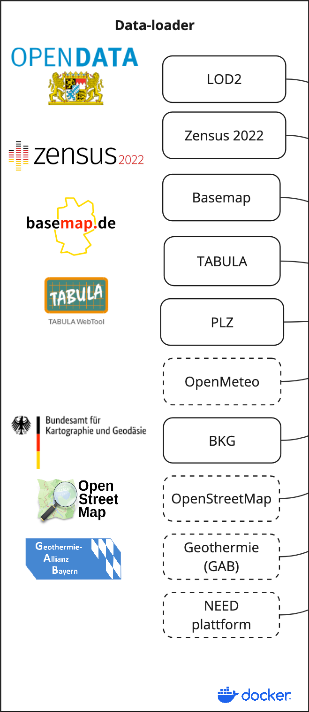

<p align="center">
   
</p>

# infDB-loader - Open Data Importer

**The infDB-loader is a open source tool to import public opendata into infDB.**

| Category | Badges |
|----------|--------|
| License | [](LICENSE) |
| Documentation | [](https://gitlab.lrz.de/tum-ens/need/database) |
| Development | [](https://gitlab.lrz.de/tum-ens/need/database/-/issues) [](https://gitlab.lrz.de/tum-ens/need/database/-/issues) [](https://gitlab.lrz.de/tum-ens/need/database/-/merge_requests) [](https://gitlab.lrz.de/tum-ens/need/database/-/merge_requests) |
| Community | [](docs/contributing/CONTRIBUTING.md) [](#) [](#) |

## Table of Contents

- [Purpose](#purpose)
- [How it works?](#how-it-works)
- [Getting Started](#getting-started)
  - [Installation for local development](#installation-for-local-development)
- [For Developers](#for-developers)
   - [Repository Structure](#repository-structure)
   - [Usage Guidelines](#usage-guidelines)
   - [Basic API Usage](#basic-api-usage)
   - [Development Workflow](#development-workflow)
   - [API Documentation](#api-documentation)
   - [CI/CD Workflow](#cicd-workflow)
   - [Development Resources](#development-resources)
   - [Contribution and Code Quality](#contribution-and-code-quality)
- [License and Citation](#license-and-citation)

## Purpose

**infDB-loader** is a flexible and easy-to-configure data loader to import public open data.

The following sources can be selected:
- [LOD2 (Bavaria)](https://geodaten.bayern.de/opengeodata/openlod/2/)
- [Zensus 2022](https://www.zensus2022.de/DE/Ergebnisse-des-Zensus/_inhalt.html)
- [Basemap](https://www.basemap.de/)
- [TABULA](https://tabula.ens.tum.de/)

<p align="center">
    
</p>


## Getting Started
To get started, follow these steps. For detailed instructions and additional information, see the [infDB documentation](https://infdb.readthedocs.io/).

# For Developers

### Local development environment for InfDB for developers
```bash
    # on linux and macos by installation script
    curl -LsSf https://astral.sh/uv/install.sh | sh
    # or by pip
    pip install uv
```

### Create environment (only once)
```bash
    # linux and macos
    uv sync
```

### Activate environment
```bash
    # linux and macos
    source .venv/bin/activate
    # windows
    venv\Scripts\activate
```
### Clean repo
```bash
    # linux and macos
    git fetch origin
    git reset --hard origin/develop
    git clean -fdx
    # windows
```

## Repository Structure

- **src/**: Main application package
  - **api/**: API endpoints (cityRouter.py, weatherRouter.py)
  - **core/**: Core application code (dbConfig.py, etc.)
  - **db/**: Database models and repositories
    - **models/**: SQLModel classes for database entities
    - **repositories/**: Data access layer for database operations
  - **exceptions/**: Custom exception classes
  - **externals/**: External API integrations (e.g., weather API)
  - **schemas/**: Data schemas and validation
  - **services/**: Business logic services
  - **main.py**: Application entry point
- **docs/**: Documentation
  - **architecture/**: System architecture documentation
  - **contributing/**: Contribution guidelines and code of conduct
  - **development/**: Developer guides and workflows
  - **guidelines/**: Project guidelines and standards
  - **operations/**: Operational guides and CI/CD documentation
  - **source/**: Source files for documentation
  - **img/**: Images used in documentation
- **dockers/**: Docker configuration files
- **tests/**: Test suite
  - **unit/**: Unit tests for individual components
  - **integration/**: Tests for component interactions
  - **e2e/**: End-to-end tests for the application
  - **conftest.py**: Pytest configuration and fixtures


## Development Workflow

1. **Set up the environment** following the installation instructions.
2. **Open an issue** to discuss new features, bugs, or changes.
3. **Create a new branch** for each feature or bug fix based on an issue.
4. **Implement the changes** following the coding guidelines.
5. **Write tests** for new functionality or bug fixes.
6. **Run tests** to ensure the code works as expected.
7. **Create a merge request** to integrate your changes.
8. **Address review comments** and update your code as needed.
9. **Merge the changes** after approval.


## CI/CD Workflow

The CI/CD workflow is set up using GitLab CI/CD. The workflow runs tests, checks code style, and builds the documentation on every push to the repository. You can view workflow results directly in the repository's CI/CD section. For detailed information about the CI/CD workflow, see the [CI/CD Guide](docs/operations/CI_CD_Guide.md).

## Development Resources

The following resources are available to help developers understand and contribute to the project:

### Coding Guidelines

The [Coding Guidelines](docs/guidelines/coding_guidelines.md) document outlines the coding standards and best practices for the project. Start here when trying to understand the project as a developer.

### Architecture Documentation

The [Architecture Documentation](docs/architecture/index.rst) provides an overview of the system architecture, including the database schema, components, and integration points.

### Developer Guides

- [Development Setup Guide](docs/development/setup.md): Comprehensive instructions for setting up a development environment
- [Contribution Workflow](docs/development/workflow.md): Step-by-step process for contributing to the project
- [API Development Guide](docs/development/api_guide.md): Information for developers who want to use or extend the API
- [Database Schema Documentation](docs/development/database_schema.md): Detailed information about the database schema

### Contribution Guidelines

- [Contributing Guide](docs/contributing/CONTRIBUTING.md): Guidelines for contributing to the project
- [Code of Conduct](docs/contributing/CODE_OF_CONDUCT.md): Community standards and expectations
- [Release Procedure](docs/contributing/RELEASE_PROCEDURE.md): Process for creating new releases

### Operations Documentation

- [CI/CD Guide](docs/operations/CI_CD_Guide.md): Detailed information about the CI/CD workflow

## Contribution and Code Quality

Everyone is invited to develop this repository with good intentions. Please follow the workflow described in the [CONTRIBUTING.md](docs/contributing/CONTRIBUTING.md).

### Coding Standards

This repository follows consistent coding styles. Refer to [CONTRIBUTING.md](docs/contributing/CONTRIBUTING.md) and the [Coding Guidelines](docs/guidelines/coding_guidelines.md) for detailed standards.

### Pre-commit Hooks

Pre-commit hooks are configured to check code quality before commits, helping enforce standards.

### Changelog

The changelog is maintained in the [CHANGELOG.md](CHANGELOG.md) file. It lists all changes made to the repository. Follow instructions there to document any updates.

# License and Citation

The code of this repository is licensed under the **MIT License** (MIT).  
See [LICENSE](LICENSE) for rights and obligations.  
See the *Cite this repository* function or [CITATION.cff](CITATION.cff) for citation of this repository.  
Copyright: [TU Munich - ENS](https://www.epe.ed.tum.de/en/ens/homepage/) | [MIT](LICENSE)